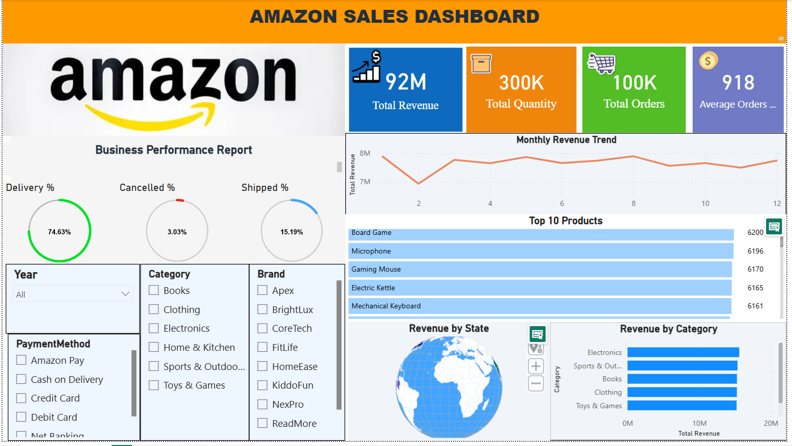

# 📊 Amazon Sales Analysis Dashboard

<p align="center">


</p>

---

# 📌 Project Overview

This project presents an **interactive Amazon Sales Analysis Dashboard** developed using **Power BI**, **Python**, **SQL**, and **Excel**.

The dashboard transforms raw sales data into meaningful business insights by analyzing revenue, customer purchasing behavior, product performance, and regional sales trends through interactive visualizations.

---

# ✨ Key Features

- 📊 Interactive Power BI Dashboard
- 💰 Revenue Analysis
- 📦 Total Orders & Quantity Analysis
- 💳 Average Order Value
- 📈 Monthly Revenue Trends
- 🏷️ Category-wise Sales Performance
- 🏆 Top Selling Products
- 🗺️ State-wise Revenue Analysis
- 🎯 Interactive Filters & Slicers

---

# 🛠️ Technologies Used

| Technology | Purpose |
|------------|---------|
| Power BI | Dashboard Development |
| DAX | KPI Calculations |
| Power Query | Data Transformation |
| Python | Data Cleaning & Analysis |
| SQL | Data Analysis |
| Excel | Data Preparation |

---

# 📊 Dashboard KPIs

- 💰 Total Revenue
- 📦 Total Orders
- 🛒 Total Quantity Sold
- 💳 Average Order Value
- 📈 Monthly Revenue Trend
- 🏆 Top Products
- 🌍 State-wise Revenue

---

# 📈 Business Insights

- Electronics generated the highest revenue among all product categories.
- Delivery success rate exceeded **74%**, indicating efficient order fulfillment.
- Monthly revenue showed consistent performance with seasonal growth periods.
- Top-selling products contributed significantly to overall revenue.
- Revenue distribution varied across states, highlighting regional market opportunities.

---

# 📷 Dashboard Preview



---

# 📂 Folder Structure

```text
Amazon-Sales-Analysis/
│
├── Dashboard/
│   └── Amazon_Sales_Dashboard.pbix
│
├── Dataset/
│   └── Amazon.csv
│
├── Images/
│   └── Dashboard.png
│
├── Python/
│   └── Amazon_Sales_Analysis.ipynb
│
├── SQL/
│   └── Amazon_Sales_Queries.sql
│
├── README.md
├── LICENSE
├── requirements.txt
└── .gitignore
```

---

# 🚀 Getting Started

## Clone the Repository

```bash
git clone https://github.com/Santhosh-271121/Amazon-Sales-Analysis.git
```

## Navigate to the Project

```bash
cd Amazon-Sales-Analysis
```

## Install Python Dependencies

```bash
pip install -r requirements.txt
```

## Open the Dashboard

Open:

```text
Dashboard/Amazon_Sales_Dashboard.pbix
```

using **Microsoft Power BI Desktop**.

---

# 🎯 Future Improvements

- Sales Forecasting using Machine Learning
- Customer Segmentation
- Inventory Demand Prediction
- Real-Time Dashboard Integration
- Streamlit Web Dashboard

---

# 👨‍💻 Author

**Santhosh C**

🎓 B.Tech – Computer Science & Software Engineering (CSSE)

📊 Data Analyst | Python Developer | AI & Computer Vision Enthusiast

- 🌐 GitHub: https://github.com/Santhosh-271121
- 💼 LinkedIn: https://www.linkedin.com/in/santhosh-c-19a766335

---

<p align="center">

⭐ **If you found this project helpful, consider giving it a Star!**

</p>
